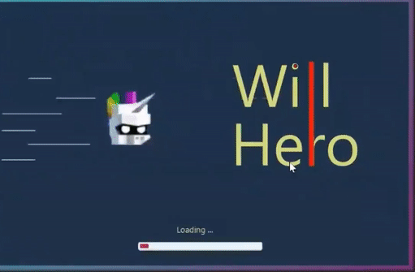
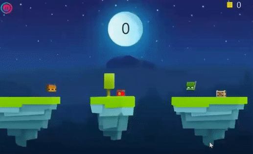
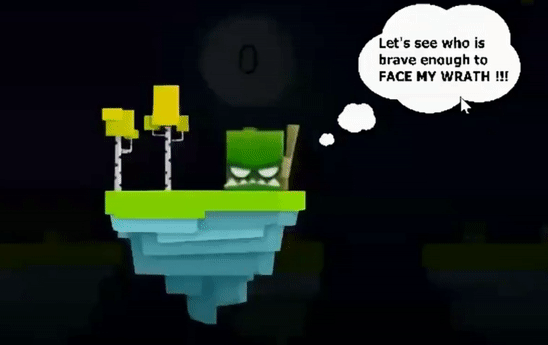

This project is a JavaFX clone of the renowned game "**Will Hero**" offering visually captivating graphics and engaging gameplay. It has been developed using Java, **JavaFX**, and Scene Builder, utilizing **object-oriented programming** principles for efficient and scalable code.

### :sparkles: Features

- Incorporates **_Serialization_** and implemented using **_OOPS_** principles to ensure modularity, maintainability, and extensibility of the code. 
- Utilized modern **JavaFX** framework and **Scene Builder** for efficient UI development. 

[Demo Video](https://youtu.be/DGKwRpVyZYY)   
